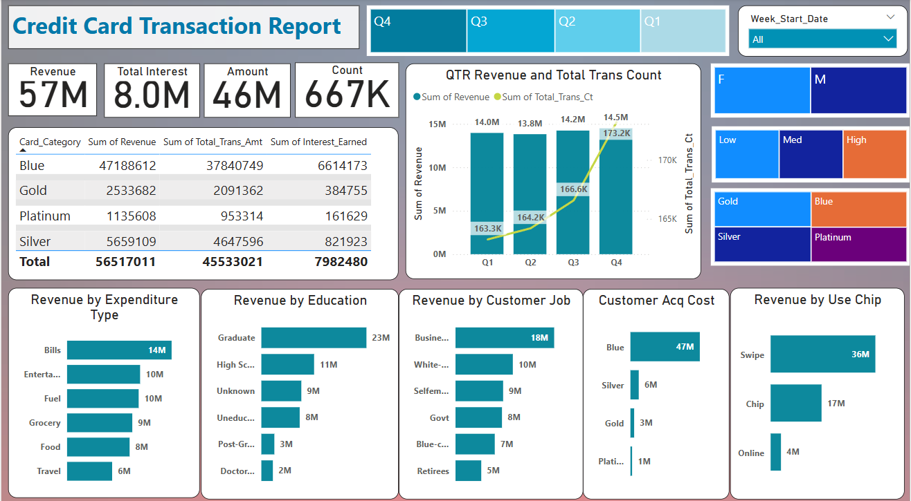
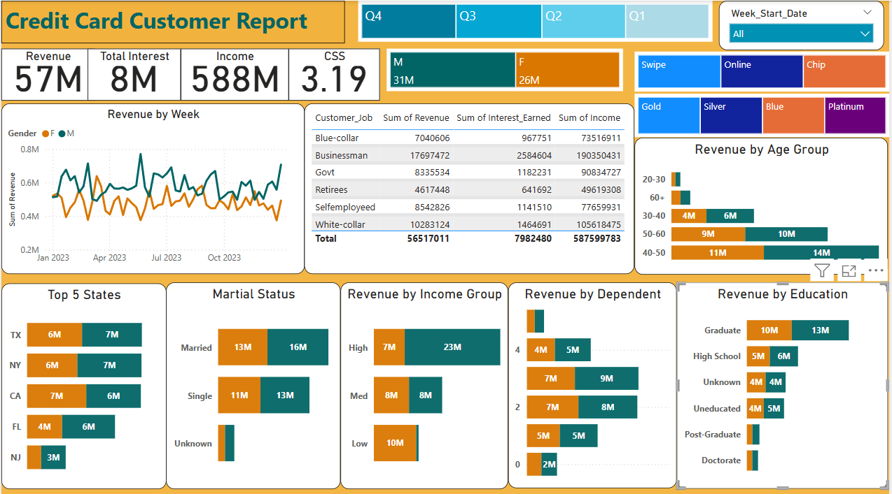

# Credit Card Analytics Dashboard

## Table of Contents
1. [Overview](#overview)
2. [Features](#features)
3. [Screenshots](#screenshots)
   - [Weekly Credit Card Transaction Report](#weekly-credit-card-transaction-report)
   - [Weekly Credit Card Customer Report](#weekly-credit-card-customer-report)
4. [Dataset Download](#dataset-download)
5. [DAX Queries Used](#dax-queries-used)
   - [AgeGroup Column in cust_detail Table](#agegroup-column-in-cust_detail-table)
   - [IncomeGroup Column in cust_detail Table](#incomegroup-column-in-cust_detail-table)
   - [week_num2 Measure in credit_detail Table](#week_num2-measure-in-credit_detail-table)
   - [Revenue Measure in credit_detail Table](#revenue-measure-in-credit_detail-table)
   - [Current_week_Revenue Measure in credit_detail Table](#current_week_revenue-measure-in-credit_detail-table)
   - [Previous_week_Revenue Measure in credit_detail Table](#previous-week-revenue-measure-in-credit_detail-table)
6. [Project Insights](#project-insights)
7. [Technologies Used](#technologies-used)
8. [Author](#author)

## Overview
To develop a comprehensive credit card weekly dashboard that provides real-time insights into key performance metrics and trends, enabling stakeholders to monitor and analyza credit card operations effectively.

## Features
- **Weekly Credit Card Transaction Report**: Provides revenue, interest, transaction count, and expenditure analysis.
- **Weekly Credit Card Customer Report**: Analyzes customer demographics, spending patterns, and revenue segmentation.
- **Interactive Filters**: Allows users to filter by quarter, gender, transaction type, card category, and more.
- **Visual Representations**: Bar charts, line graphs, and tables for better data insights.

## Screenshots

### Weekly Credit Card Transaction Report


### Weekly Credit Card Customer Report


## Dataset Download
The dataset used in this project can be downloaded from the following GitHub repositories:
- dataset/credit_card.csv
- dataset/customer.csv
- dataset/cust_add.csv
- dataset/cc_add.csv

## DAX Queries Used
Here are some of the DAX queries used in the Power BI dashboard:

### AgeGroup Column in cust_detail Table
```DAX
AgeGroup = SWITCH(
    TRUE(),
    'cust_detail'[Customer_age] < 30,"20-30",
    'cust_detail'[Customer_age] >= 30 && 'cust_detail'[Customer_age] < 40,"30-40",
    'cust_detail'[Customer_age] >= 40 && 'cust_detail'[Customer_age] < 50,"40-50",
    'cust_detail'[Customer_age] >= 50 && 'cust_detail'[Customer_age] < 60,"50-60",
    'cust_detail'[Customer_age] >= 60, "60+",
    "unknown" 
)
```

### IncomeGroup Column in cust_detail Table
```DAX
IncomeGroup = SWITCH(
    TRUE(),
    'cust_detail'[Income] < 35000,"Low",
    'cust_detail'[Income] >= 35000 && 'cust_detail'[Income] < 70000, "Med",
    'cust_detail'[Income] >= 35000,"High",
)
```

### week_num2 Measure in credit_detail Table
```DAX
week_num2 = WEEKNUM('credit_detail'[Week_start-date])
```

### Revenue Measure in credit_detail Table
```DAX
Revenue = 'credit_detail'[annual_fees] + 'credit_detail'[Total_trans_amt] + 'credit_detail'[interest_earned]
```

### Current_week_Revenue Measure in credit_detail Table
```DAX
Current_week_Revenue = CALCULATE(
    SUM('credit_detail'[Revenue]),
    FILTER(
        ALL('credit_detail'),
        'credit_detail'[week_num2] = MAX('credit_detail'[week_sum2])
    )
)
```

### Previous_week_Revenue Measure in credit_detail Table
```DAX
Previous_week_Revenue = CALCULATE(
    SUM('credit_detail'[Revenue]),
    FILTER(
        ALL('credit_detail'),
        'credit_detail'[week_num2] = MAX('credit_detail'[week_sum2]) - 1
    )
)
```

## Project Insights
### Week to week Change:
- **Revenue Growth**: Revenue increased by **28.8%**.
- **Transaction Growth**: Total transaction amount and count increased.
- **Customer Base**: Customer count increased.

### Overview Year to date:
- **Overall Revenue**: **57M**.
- **Total Interest**: **8M**.
- **Total Transaction Amount**: **46M**.
- **Customer Revenue Contribution**: Male customers contribute **31M**, while female customers contribute **26M**.
- **Card Contribution**: Blue & Silver credit cards contribute **93%** of overall transactions.
- **Top Contributing States**: TX, NY, and CA contribute **68%**.
- **Activation Rate**: **57.5%**.
- **Delinquency Rate**: **6.06%**.

## Technologies Used
- **Power BI** for data visualization
- **DAX (Data Analysis Expressions)** for data calculations
- **SQL** for data extraction and transformation

## Author
- **PAYAL PAWAR**


